<p align="center"></p>

# Nozy

* [Introduction](#introduction)
* [Features](#features)
* [Screenshots](#screenshots)
* [Launch](#launch)
* [Technologies](#technologies)

<h2 id="introduction">Introduction</h2>

Nozy is a discussion board web app that allows users to connect with each other through community based discussion.

This is the Github page for the Main Content MVC part of the application, not the Comments Microservice.

<h2 id="features">Features</h2>

- Login/logout
- Profile Create/Edit
- Post Create/Edit/Delete
- Community Create/Edit/Delete
- Rate posts with Like/Dislike system
- AJAX Search for Users/Communities/Posts
- Comment Create/Edit/Delete
    - Nested comments

<h2 id="screenshots">Screenshots</h2>

### Opening Website
<p align="center">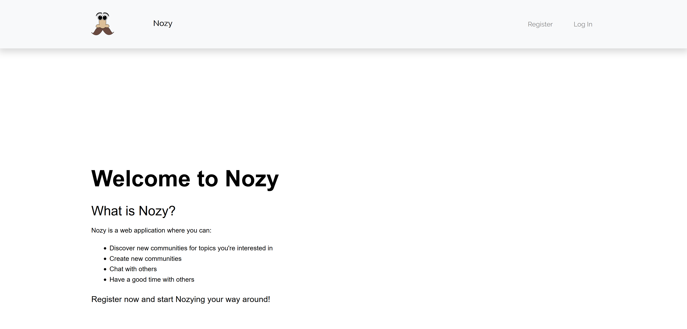</p>

### Opening profile page
<p align="center">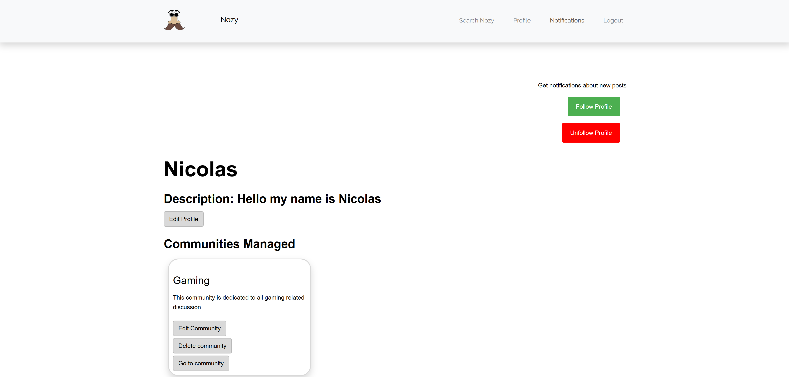</p>
<p align="center">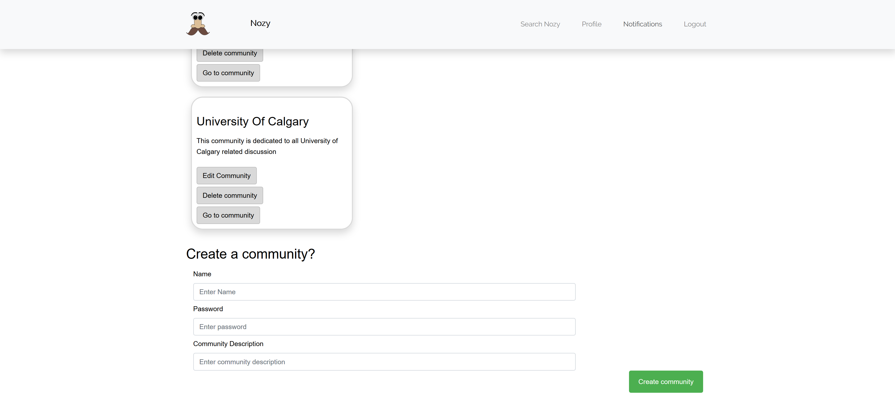</p>
<p align="center"></p>

### Opening your notifications
<p align="center">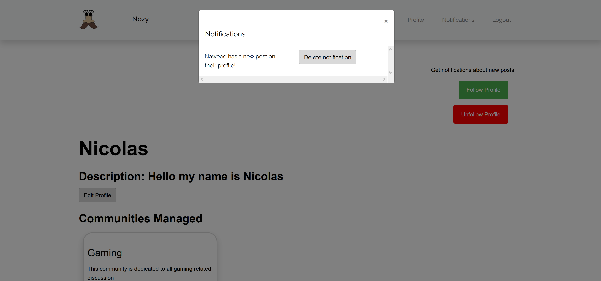</p>

### Opening a community profile
<p align="center">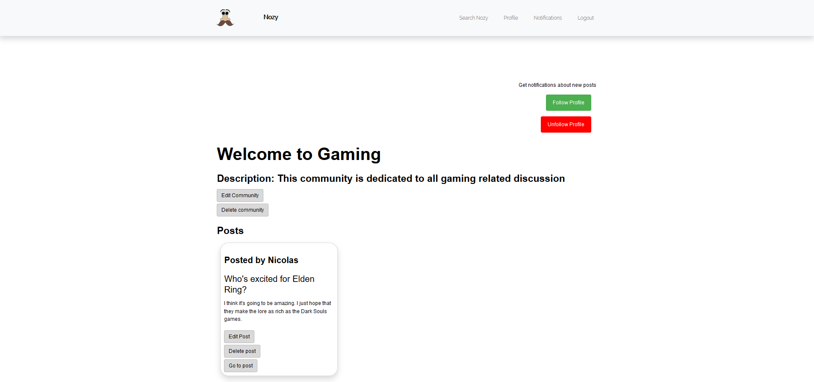</p>

### Opening a post if the Comments Microservice is running
<p align="center"></p>

### Opening a post if the Comments Microservice is down
<p align="center">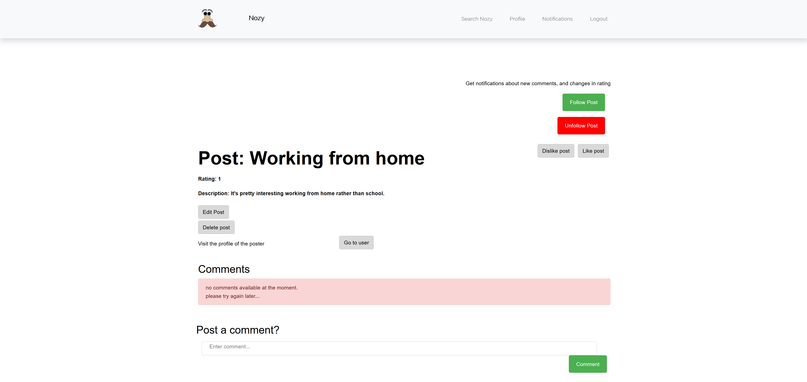</p>

### Making nested comments
<p align="center">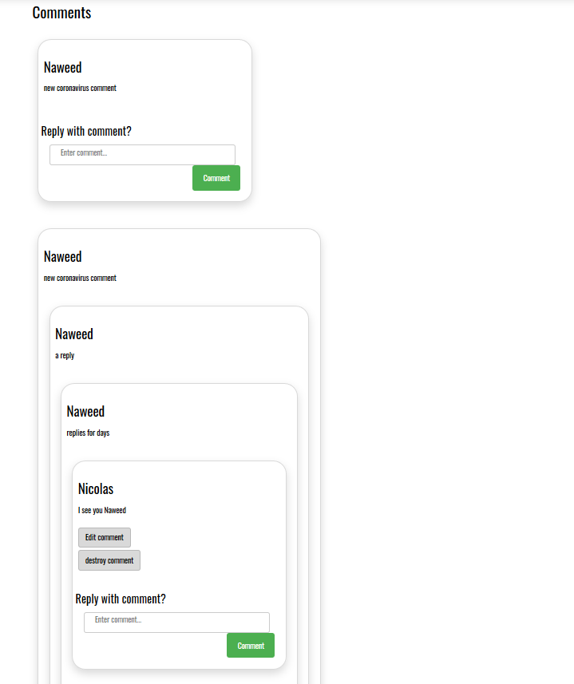</p>

### Searching users, communities, and posts
<p align="center">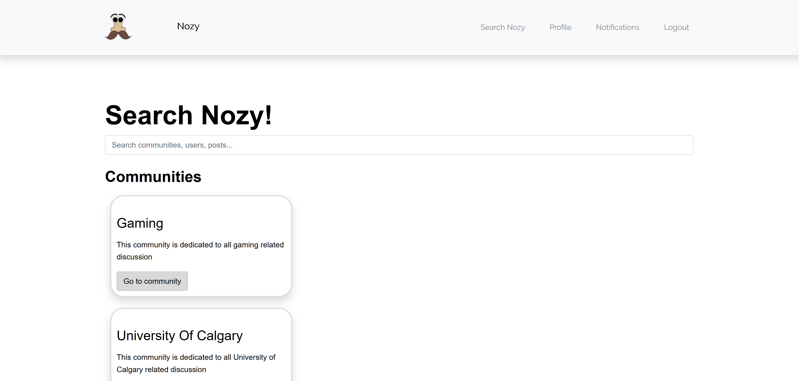</p>
<p align="center"></p>

<h2 id="launch">Launch</h2>

### Setup
To install dependencies, in root folder of project run:
```
composer install
```
Create .env file in root folder of project.

Update database connection information in .env file.

Generate APP_KEY in .env file by running:
```
php artisan key:generate
```
To create tables, run:
```
php artisan migrate:refresh
```
To seed database, run:
```
php artisan db:seed
```

### Cloud Deployment
The website was originally deployed using [Cloudways](https://www.cloudways.com/en/), but is no longer deployed to the cloud.

### Serve Locally
To serve application locally (development server), run:
```
php artisan serve
```

<h2 id="technologies">Technologies</h2>

- [PHP 7.3.6](https://www.php.net)
- [Laravel PHP Web Framework 5.8.21](https://laravel.com)
- [HTML5](https://html.com/html5/)
- [CSS3](https://developer.mozilla.org/en-US/docs/Glossary/CSS)

## General Software Architecture Diagram
<p align="center">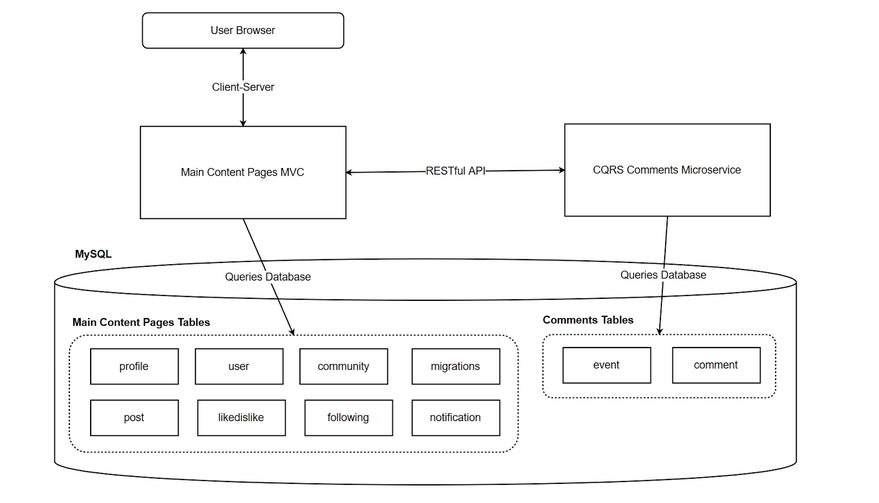</p>

## Main Content Pages MVC Software Architecture Diagram
The main content pages of the application are served with a PHP [Laravel](https://laravel.com/) MVC application.
<p align="center">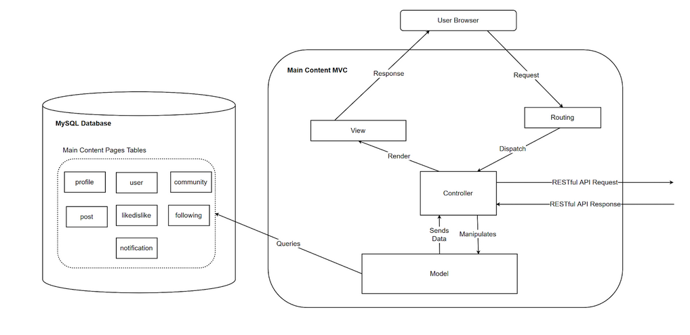</p>

## Comments Microservice Software Architecture Diagram
The comments are served by a [Python Flask Microservice](https://github.com/harindu95/CommentsMicroservice) .
<p align="center">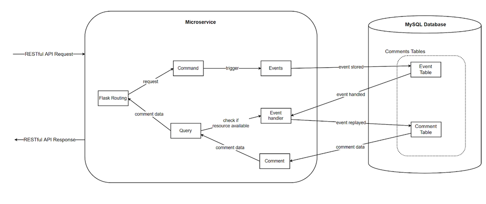</p>

