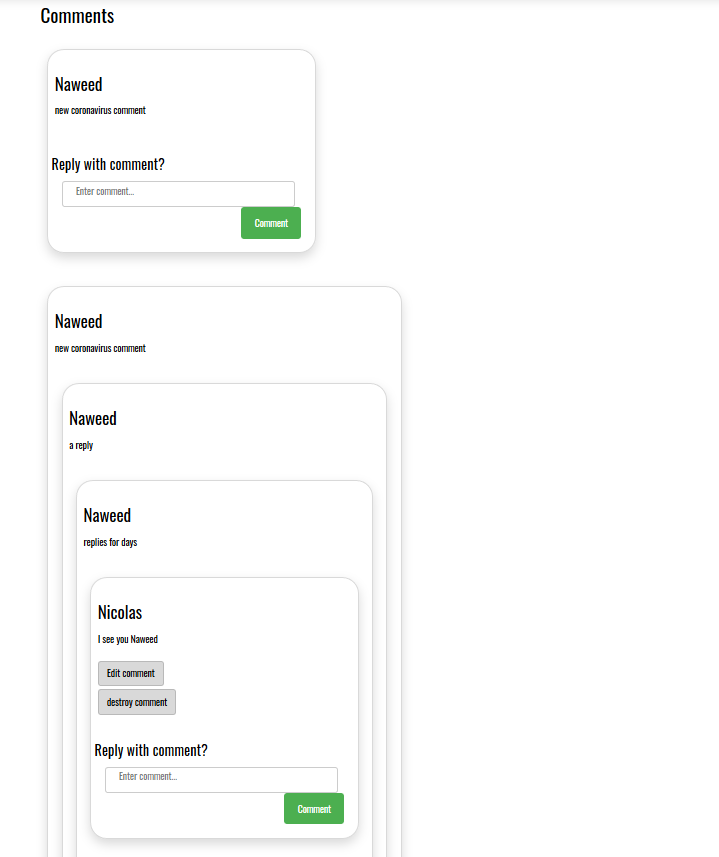

## About Nozy

Nozy is a discussion board web app that allows users to connect with each other through community based discussion.

## General Software Architecture

## Main Content Pages MVC Software Architecture
The main content pages of the application are served with a PHP Laravel MVC application.

## Comments Microservice Software Architecture
The comments are served by a Python Flask Microservice

## Examples of Use Cases

- Opening Website

- Opening profile page

- Opening your notifications

- Opening a community profile

- Opening a post if the Comments Microservice is running

- Opening a post if the Comments Microservice is down

- Nested comments if the Comments Microservice is running

- Nested comments if the Comments Microservice is down

- Searching users, communities, and posts

