

## About Nozy

Nozy is a discussion board web app that allows users to connect with each other through community based discussion.

## General Software Architecture

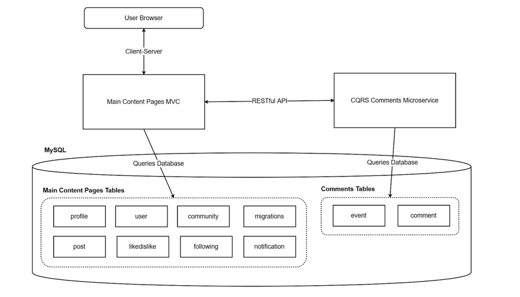

## Main Content Pages MVC Software Architecture
The main content pages of the application are served with a PHP Laravel MVC application.

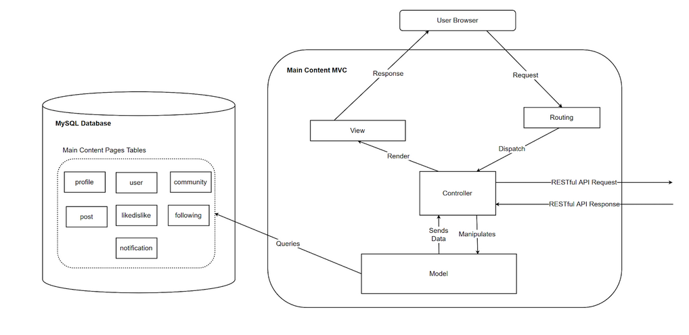

## Comments Microservice Software Architecture
The comments are served by a Python Flask Microservice.

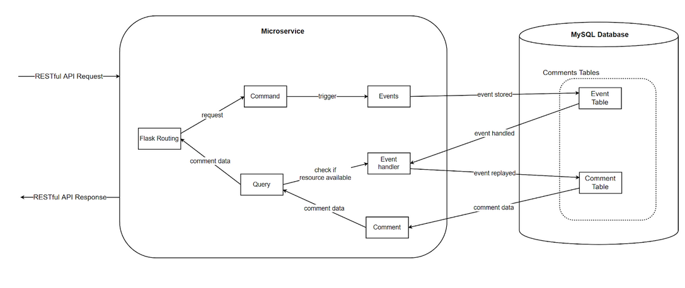

## Examples of Use Cases

- Opening Website

- Opening profile page

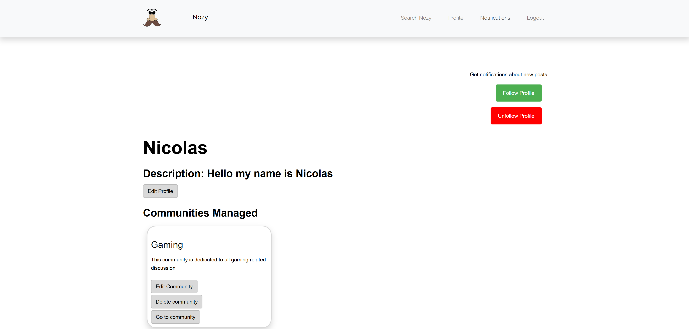

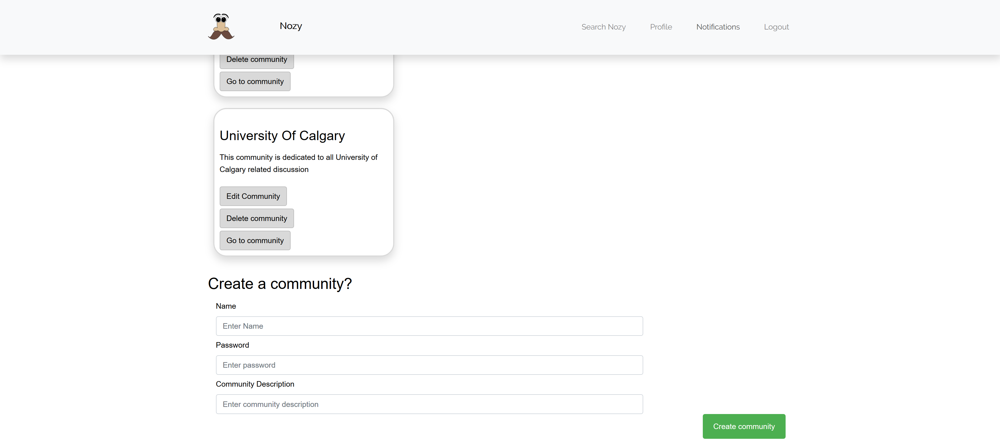

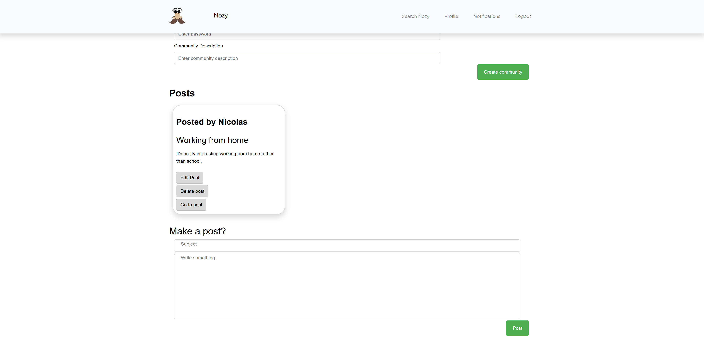

- Opening your notifications

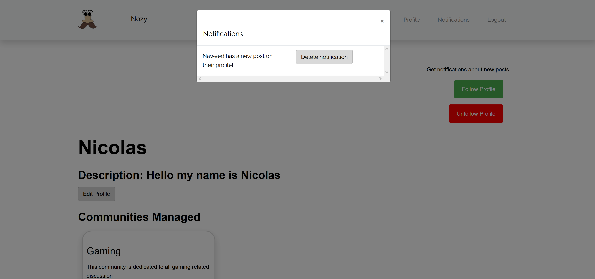

- Opening a community profile

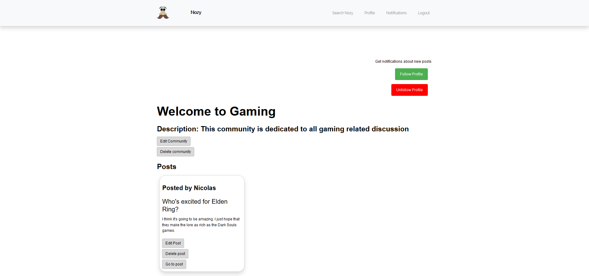

- Opening a post if the Comments Microservice is running

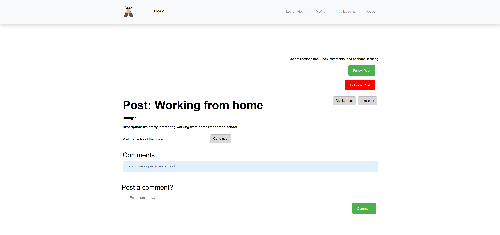

- Opening a post if the Comments Microservice is down

- Nested comments if the Comments Microservice is running

- Nested comments if the Comments Microservice is down

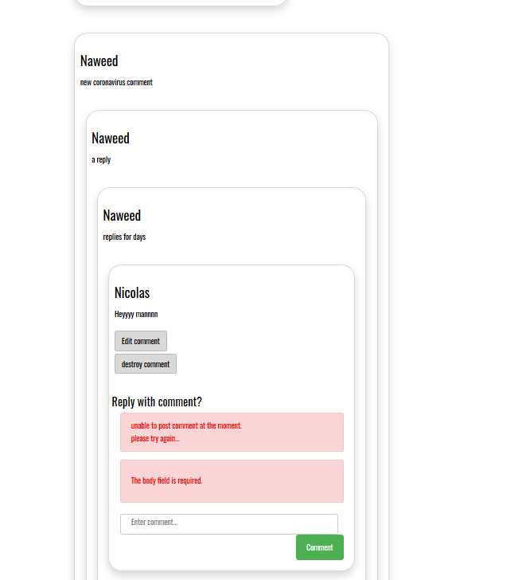

- Searching users, communities, and posts

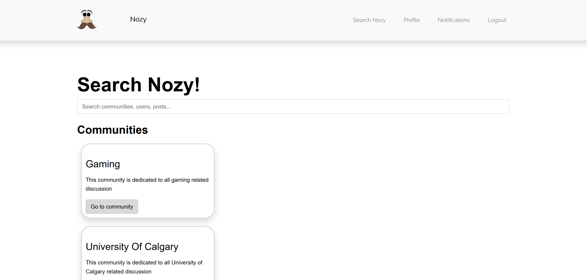

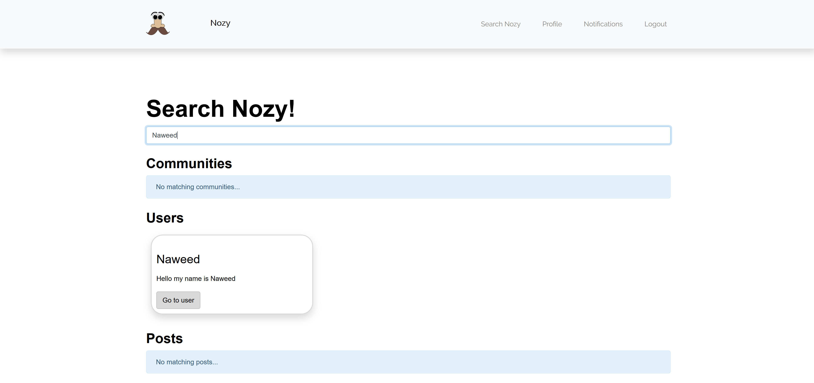

